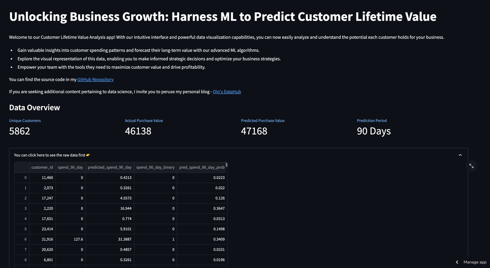
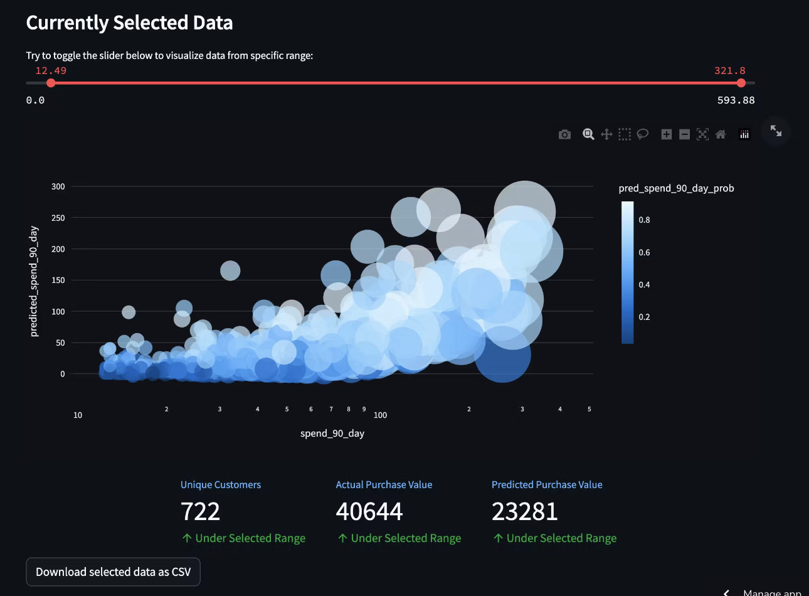

# -Data-Driven-Marketing-Predicting-Customer-Lifetime-Value-CLV-

## **Introduction**

This repo contains code and resources for predicting the Customer Lifetime Value, an essential metric that helps businesses understand the long-term value of their customers. By utilizing the power of XGBoost algorithm, this project aims to deliver accurate predictions to aid in strategic decision-making and customer segmentation.

### How to Use

To utilize this Customer Lifetime Value Prediction project, follow these steps:

* Clone the Repository: Begin by cloning this repository to your local machine using the following command: 

* Install Dependencies: Navigate to the project directory and install the required dependencies using the requirements.txt file: `pip install -r requirements.txt`

* Data Transformation and Feature Engineering: Open the `main.ipynb` Jupyter Notebook and follow the step-by-step instructions to transform the data, perform EDA, and engineer the necessary RFM features.

* Model Training and Evaluation: Continue with the `main.ipynb` Notebook to train the XGBoost model and evaluate its performance using cross-validation techniques.

* Visualization using Streamlit: To use the Streamlit app for CLV prediction visualization, execute the following command in your terminal: `streamlit run visualization.py`. Access the app through your web browser by visiting , where you can visualize the model prediction results.

